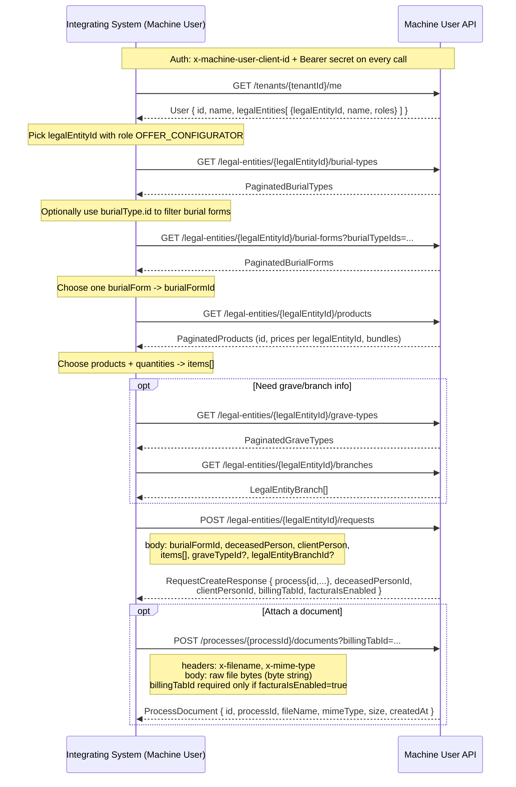
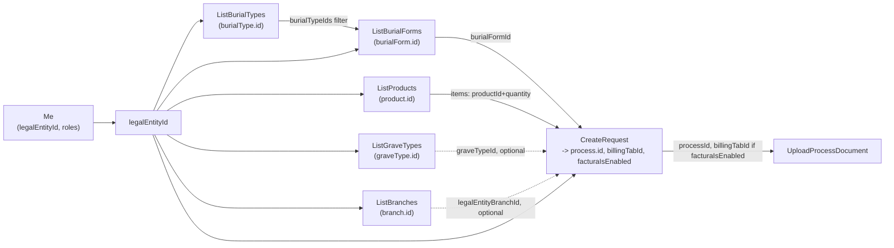

# Machine User API — Integration Guide

This guide explains how to use the [Machine User API](openapi.json) to submit requests on behalf of a tenant: which endpoints exist and the order to call them
in.

The API is meant for **machine-to-machine (M2M) integrations** — there is no login
flow or user session, only a client id/secret pair issued per tenant.

## The following Use-Cases are currently available

1. [Offer configuration](#offer-configuration)

---

## Authentication

Every request must carry two headers:

| Header | Type | Description |
|---|---|---|
| `x-machine-user-client-id` | API key | Identifies the machine user (tenant-scoped client). |
| `Authorization` | `Bearer <client-secret>` | The machine user's client secret. |

Both credentials are issued by the tenant admin — there is no token/OAuth
exchange endpoint in this API. Store them as static secrets on the integrating
system and send them with **every** call.

There is a single production server:

```
https://funeral-management.api.cleverone.io
```

All paths are additionally namespaced by `tenantId` and (for most endpoints)
`legalEntityId`:

```
/machine-user-api/v1/tenants/{tenantId}/legal-entities/{legalEntityId}/...
```

`tenantId` must be known ahead of time (it identifies your organization in
CleverOne). `legalEntityId` identifies the specific legal entity (e.g. a funeral
home branch/company) you are acting on behalf of — see [`Me`](#31-me--identify-the-machine-user) below for how
to discover which legal entities and permissions your machine user has.

---

## Offer Configuration

### 1. Endpoint overview

| # | Endpoint | Method | Purpose |
|---|---|---|---|
| 2.1 | `/tenants/{tenantId}/me` | GET | Identify the machine user and list accessible legal entities + roles |
| 2.2 | `/.../legal-entities/{legalEntityId}/burial-types` | GET | List available burial types |
| 2.3 | `/.../legal-entities/{legalEntityId}/burial-forms` | GET | List burial forms, optionally filtered by burial type |
| 2.4 | `/.../legal-entities/{legalEntityId}/products` | GET | List catalog products/bundles to add to the offer |
| 2.5 | `/.../legal-entities/{legalEntityId}/grave-types` | GET | (Optional) List grave types |
| 2.6 | `/.../legal-entities/{legalEntityId}/branches` | GET | (Optional) List legal entity branches (locations) |
| 2.7 | `/.../legal-entities/{legalEntityId}/requests` | POST | **Create** the offer request (the core write operation) |
| 2.8 | `/.../legal-entities/{legalEntityId}/processes/{processId}/documents` | POST | Upload a document (e.g. signed PDF) to the created process |

All list endpoints require role `OFFER_CONFIGURATOR` on the target legal entity
(see [`Me`](#31-me--identify-the-machine-user)) and support cursor-based pagination (`cursor`, `limit`,
`nextCursor`/`prevCursor`) plus `query`/`sortBy`/`sortDirection` filtering.

---

### 2. End-to-end flow

The overall integration flow, as documented directly on the `CreateRequest`
operation, is:

1. Have your `tenantId` and `legalEntityId` ready (known ahead of time, or
   discovered via `Me`).
2. List the available burial forms and choose one.
3. List the available products and choose which to include, with quantities
   (these become the request's `items`).
4. Provide the deceased person's and the client's information.
5. Optionally look up grave type and legal entity branch information.
6. Create the request. Then, optionally, upload a supporting PDF document
   using the `processId` returned by the create call.



#### Why this order matters

- **`Me` first**: it's the only endpoint that tells you *which* `legalEntityId`
  values your machine user is authorized for, and which roles it has on each. All
  other endpoints need a `legalEntityId` in the path and reject requests without
  the `OFFER_CONFIGURATOR` role.
- **Burial types → burial forms**: `ListBurialForms` accepts `burialTypeIds` as a
  filter, and each `BurialForm` embeds its `burialType`. If you already know which
  kind of burial (cremation/earth/neutral) applies, fetch burial types first to
  get valid IDs to filter by; otherwise you can skip straight to burial forms.
- **Products before `CreateRequest`**: the request body only accepts `productId` +
  `quantity` (`SelectItemDto`), not names or prices — you must resolve the actual
  `Product.id` values (and check `ProductPrice.active`/`price` for the relevant
  `legalEntityId`) from `ListProducts` first.
- **Grave type / branch are optional enrichments**: `graveTypeId` and
  `legalEntityBranchId` on `RequestCreateDto` are not required — include them only
  if the offer needs to reflect a specific grave type or servicing branch.
- **Documents come last, and need the process**: `UploadProcessDocument` requires
  `processId`, which only exists after `CreateRequest` succeeds and returns
  `RequestCreateResponse.process.id`. If `RequestCreateResponse.facturaIsEnabled`
  is `true`, you must also pass the returned `billingTabId` as the `billingTabId`
  query parameter when uploading.

---

### 3. Endpoint details

#### 3.1 `Me` — identify the machine user

`GET /tenants/{tenantId}/me`

Returns the machine user's identity and, crucially, the list of legal entities
it can act on plus its roles per legal entity.

```json
{
  "id": 123,
  "name": "Machine User Name",
  "legalEntities": [
    { "legalEntityId": 45, "name": "Legal Entity Name", "roles": ["OFFER_CONFIGURATOR"] }
  ]
}
```

**Use this to decide**: which `legalEntityId` to use as the path parameter in
every subsequent call, and to confirm the machine user actually has
`OFFER_CONFIGURATOR` on it (calls will otherwise fail with `403 Forbidden`).

#### 3.2 `ListBurialTypes` — catalog of burial kinds

`GET /legal-entities/{legalEntityId}/burial-types`

Returns paginated `BurialType` items: `id`, `name`, `burialKind`
(`CREMATION` | `EARTH` | `NEUTRAL`).

**Use this to decide**: the `burialTypeIds` filter for `ListBurialForms`, if you
need to narrow the offer templates to a specific kind of burial.

#### 3.3 `ListBurialForms` — offer templates

`GET /legal-entities/{legalEntityId}/burial-forms?burialTypeIds=...`

Returns paginated `BurialForm` items: `id`, `name`, embedded `burialType`.

**Use this to decide**: `RequestCreateDto.burialFormId` — this is a **required**
field on `CreateRequest`.

#### 3.4 `ListProducts` — pricing catalog

`GET /legal-entities/{legalEntityId}/products`

Returns paginated `Product` items, each with `id`, `type`
(`BUNDLE`/`SINGLE`/`EXTERNAL`/`EXPENSE`/`IMPORT`/`SERVICE`/`PRINT`/`ON_DEMAND`),
`unit`, `taxRate`, and `prices` (per-`legalEntityId` `ProductPrice`, with
`active`, `price`, `priceGross`).

**Use this to decide**: for each product the client wants on the offer, take its
`id` and the desired `quantity` and add `{ productId, quantity }` to
`RequestCreateDto.items` (this is a **required** field). Check `ProductPrice.active`
for the target `legalEntityId` before offering a product.

#### 3.5 `ListGraveTypes` — optional grave classification

`GET /legal-entities/{legalEntityId}/grave-types`

Returns paginated `GraveType` items: `id`, `name`.

**Use this to decide**: `RequestCreateDto.graveTypeId` (optional).

#### 3.6 `ListBranches` — optional servicing location

`GET /legal-entities/{legalEntityId}/branches`

Returns a plain array of `LegalEntityBranch`: `id`, `legalEntityId`, `name`,
address fields, `phone`, `email`.

**Use this to decide**: `RequestCreateDto.legalEntityBranchId` (optional) — which
physical branch of the legal entity is handling the case.

#### 3.7 `CreateRequest` — create the offer

`POST /legal-entities/{legalEntityId}/requests`

Request body (`RequestCreateDto`):

| Field | Required | Source |
|---|---|---|
| `burialFormId` | yes | `ListBurialForms` → `BurialForm.id` |
| `clientPerson` | yes | Caller-provided (`PersonCreateDto`: `firstName`, `lastName` required; optional salutation/title/contact/address) |
| `deceasedPerson` | yes | Caller-provided (`PersonCreateDto`) |
| `items` | yes | `ListProducts` → `[{ productId: Product.id, quantity }]` |
| `graveTypeId` | no | `ListGraveTypes` → `GraveType.id` |
| `legalEntityBranchId` | no | `ListBranches` → `LegalEntityBranch.id` |

Response (`RequestCreateResponse`, `201`):

| Field | Description | Used for |
|---|---|---|
| `process.id` | The created process' id | Path param `processId` for `UploadProcessDocument` |
| `process.number`, `process.status`, `process.type` | Process metadata | Tracking/display |
| `deceasedPersonId` / `clientPersonId` | Created person ids | Reference/reconciliation |
| `facturaIsEnabled` | Whether billing (factura) is enabled for this process | Determines if `billingTabId` is required on document upload |
| `billingTabId` | The billing tab id, present when `facturaIsEnabled` | Query param `billingTabId` for `UploadProcessDocument` |

#### 3.8 `UploadProcessDocument` — attach a document

`POST /legal-entities/{legalEntityId}/processes/{processId}/documents`

Currently only supports uploading offer documents to a process just created via
`CreateRequest`.

- Path param `processId` ← `RequestCreateResponse.process.id`.
- Query param `billingTabId` — **required only if** `RequestCreateResponse.facturaIsEnabled`
  was `true`; use `RequestCreateResponse.billingTabId`.
- Headers `x-filename` and `x-mime-type` — required, describe the uploaded file.
- Body — the raw file content (`UploadProcessDocumentInputPayload`, a byte string).

Response (`ProcessDocument`, `201`): `id`, `processId`, `fileName`, `mimeType`,
`size`, `createdAt`.

---

### 4. Data flow summary



---

## Error handling

Every endpoint shares the same error shape: `400` (bad request), `401`
(missing/invalid credentials), `403` (valid credentials but missing role on the
legal entity — check `Me`), `404` (unknown tenant/legal entity/resource), `500`.
Error responses (except `500`/`400`/etc. bodies) all echo an `x-amzn-trace-id`
header — include it when reporting issues to CleverOne.
